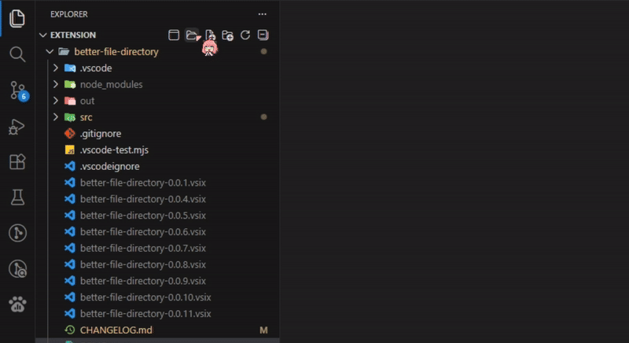
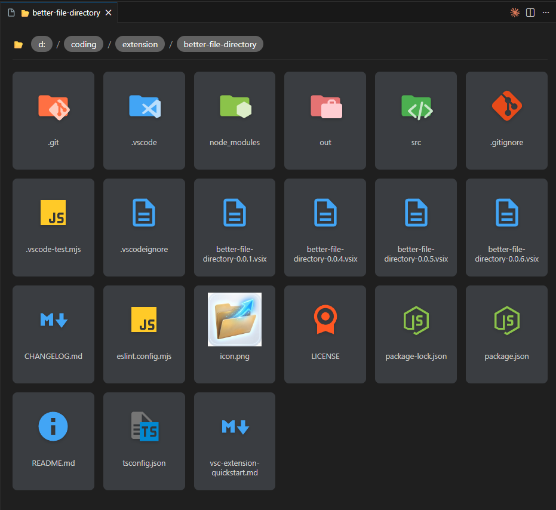
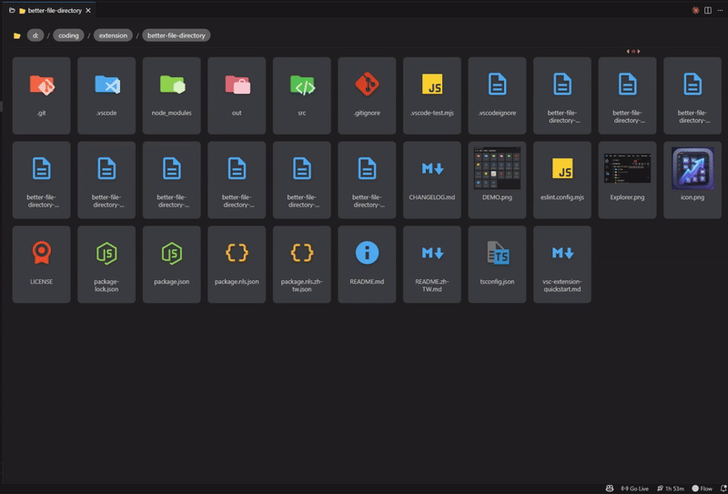
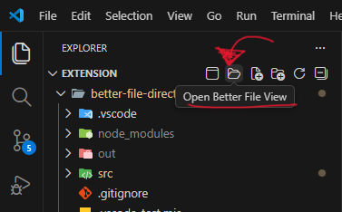
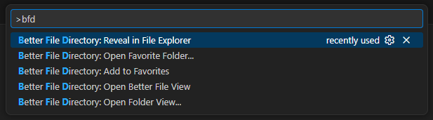

# 📂 Better File Directory


[English](./README.md) | [繁體中文](./README.zh-TW.md) 

**Better File Directory** 是一款為 VS Code 打造的現代化視覺檔案管理擴充功能。它將傳統的列表清單替換為直觀的 **網格佈局 (Grid Layout)**，結合大型縮圖與精緻的 **Material Design 圖示**，讓開發者在管理專案資產與視覺化整理檔案時更加輕鬆高效。





---

## ✨ 核心特色

* **🖼️ 視覺化網格佈局**：以大型卡片形式顯示檔案與資料夾，取代擁擠的列表。
* **🖼️ 即時縮圖**：自動為圖片檔案生成預覽縮圖。
* **📂 系統整合**：透過標題列按鈕，立即在作業系統的檔案總管中顯示目前目錄。
* **🖱️ 直覺拖放**：支援在不同分割視窗或資料夾間直接拖拽複製檔案。
* **✂️ 完整剪貼簿支援**：完美支援 `Ctrl+C` (複製) 與 `Ctrl+V` (貼上)。
* **⚡ 快速操作選單**：透過自定義右鍵選單快速新建、重新命名或刪除項目。
* **🔀 雙視窗模式**：在視窗內按下 `Ctrl + \` 即可立即開啟對應的分割面板，提升檔案傳輸效率。
* **🎨 自定義圖示**：支援透過 VS Code 設定自定義特定資料夾或副檔名的圖示。



---

## 📖 使用指南

### 1. 導覽操作
* **進入資料夾**：雙擊資料夾卡片，或選取後按 `Enter`。
* **開啟檔案**：雙擊檔案卡片，直接在 VS Code 編輯器中開啟。
* **導覽路徑 (Breadcrumbs)**：點擊頂部的路徑標籤（如 `src` / `components`）可快速跳回上層目錄。
* **在系統中顯示 (Reveal in OS)**：點擊標題列右上角的「開啟資料夾」圖示。
    * **在 Webview 中**：開啟目前正在瀏覽的特定子資料夾。
    * **在側邊欄中**：開啟工作區的根目錄。

### 2. 檔案管理 (右鍵選單)
在檔案、資料夾或空白處點擊右鍵：
* **New File...**：在當前目錄建立新檔案。
* **New Folder...**：建立子資料夾。
* **Copy / Paste**：標準剪貼簿操作。
* **Rename**：重新命名 (快速鍵：`F2`)。
* **Delete**：將項目移至垃圾桶 (快速鍵：`Delete`)。


### 3. 拖放功能
* **跨視窗複製**：將檔案卡片拖曳到另一個「Better File Directory」分割視窗即可完成複製。
* **快速備份**：在同一個視窗內小距離拖放，即可快速建立副本（例如：`image_copy.png`）。

---

## ⌨️ 快捷鍵支援

| 按鍵 | 動作說明 |
| :--- | :--- |
| **Arrow Keys** | 在檔案卡片間移動選取 |
| **Enter** | 開啟檔案 / 進入資料夾 |
| **Ctrl / Cmd + C** | 複製選取項目 |
| **Ctrl / Cmd + V** | 貼上項目至當前資料夾 |
| **F2** | 重新命名選取項目 |
| **Delete** | 刪除項目（移至垃圾桶） |
| **Ctrl / Cmd + \\** | 開啟側邊分割視窗 (Side-by-side) |




---

## 🛠️ 指令表 (Command Palette)

您可以透過 `Ctrl+Shift+P` (或 `Cmd+Shift+P`) 輸入以下指令：

| 指令 | 標題 | 描述 |
| :--- | :--- | :--- |
| `better-file-directory.current` | **View Current Folder** | 以網格視圖開啟目前的工作區根目錄 |
| `better-file-directory.open` | **Open Folder View...** | 開啟系統對話框選擇任意資料夾進行檢視 |
| `better-file-directory.revealCurrentInOS` | **Reveal in File Explorer** | 在作業系統的檔案總管中開啟目前資料夾 |



---

## ⚙️ 擴充功能設定

您可以透過圖形介面 (UI) 或編輯 `settings.json` 來自定義圖示。

**透過 UI 設定：**
進入設定 (`Ctrl+,`) 並搜尋 "Better File Directory"。您現在可以使用「新增項目 (Add Item)」按鈕，輕鬆地將關鍵字映射到圖示名稱，無需手動編輯 JSON。

**透過 JSON 設定：**
```json
{
  "better-file-directory.customFolderIcons": {
    "my-api": "folder-api",
    "private-docs": "folder-secure"
  },
  "better-file-directory.customExtensionIcons": {
    "xyz": "react",
    "data": "database"
  },
  "better-file-directory.customFileIcons": {
    "special.config": "settings"
  }
}
```

## 🆕 近期更新 
### [0.0.12] - 2026-02-06
- 在檔案總管中顯示 (Reveal in File Explorer)：在編輯器標題列新增了導航按鈕。
- 在 Webview 內點擊：顯示當前子目錄。
- 在側邊欄點擊：顯示工作區根目錄。
- 版面修正：解決了 CSS Grid 佈局問題，修復在較高螢幕上列與列之間出現異常垂直空隙的情況。
- 介面優化：修正指令圖示與選單註冊，提供更流暢的體驗。

### [0.0.10] - 2026-02-05
- 設定 UI 升級：重構了配置設定（如常用資料夾、自訂圖示等），改用 Key-Value Map 結構。這啟用了 VS Code 設定中的原生「新增項目」介面，讓管理路徑與圖示變得更簡單。
- 指令增強：better-file-directory.open 指令現在支援傳入 URI 或字串參數，方便與快捷鍵綁定或其他自動化工具整合。

## 📌 系統需求
VS Code 版本: 1.90.0 或更高。

## 📄 授權協議
[MIT License](LICENSE)

